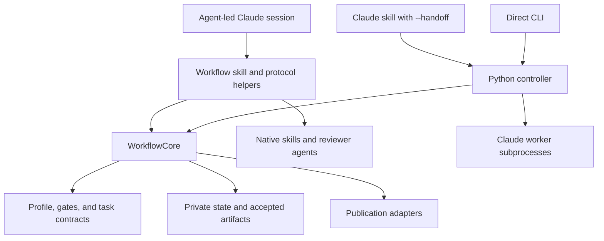
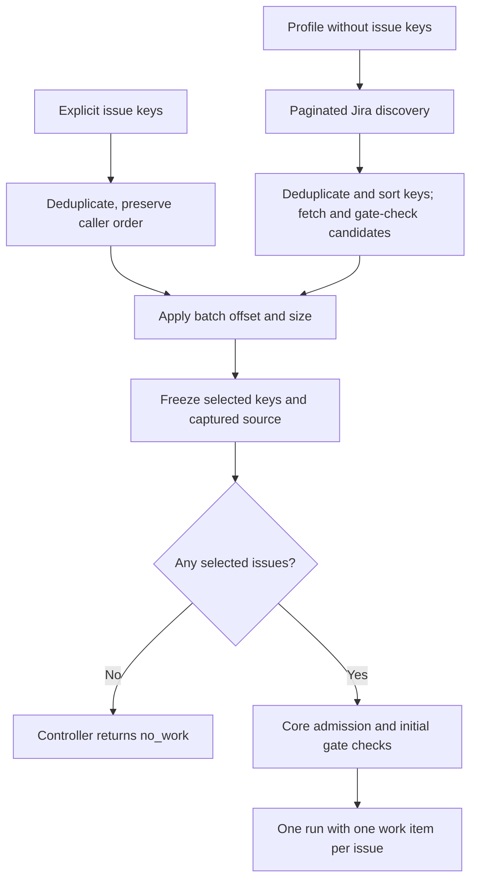
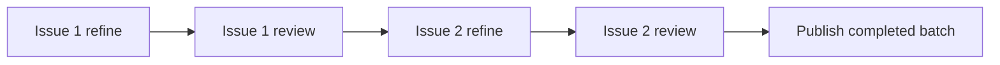
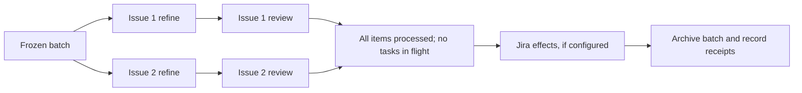
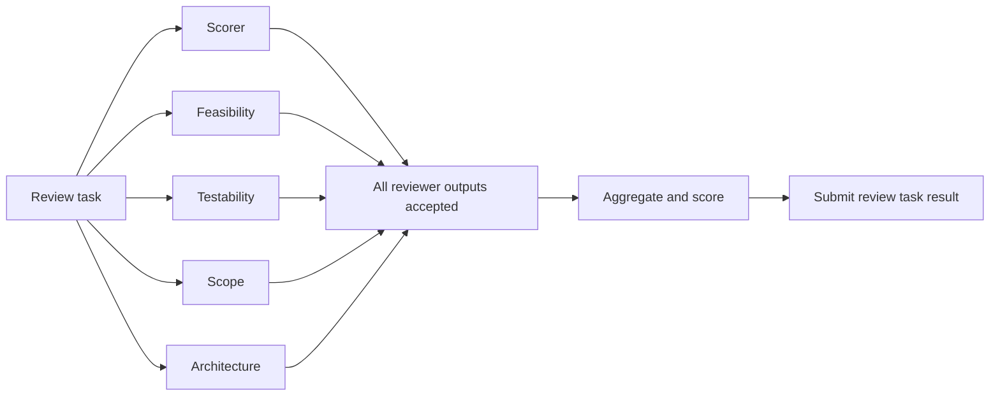

# Architecture

ADLC Workflow is a profile-driven system for producing, reviewing, and
publishing artifacts with LLM workers. The RHAI feature-creation workflow is
the primary implemented example: it consumes RHAIRFE requests and produces
reviewed feature documents and RHAISTRAT tickets. Profiles also describe other
ticket workflows; they should not be assumed to have identical capabilities
or evaluation coverage.

This document describes the current implementation. The
[controller transition plan](controller-transition-plan.md) records its design
history; proposed behavior in that plan is not necessarily implemented.

## Three ways to control the same workflow

Supporting different perspectives on agentic work is a central design choice.
An agent may drive the workflow, delegate it to a deterministic controller, or
participate only as a worker in a directly launched controller run. Keeping all
three routes available lets measured quality, reliability, cost, duration, and
operator experience determine which approach works best for a particular task.

| Execution mode | Who drives the run? | How LLM work executes |
| --- | --- | --- |
| Agent-led | An outer Claude session follows the workflow skill and invokes protocol helpers. | Forked worker skills and native reviewer agents; current feature reviews run serially. |
| Skill → CLI handoff | The outer skill invokes the Python controller once and waits for completion. | The controller starts bounded `claude -p` subprocesses. |
| Direct CLI | The Python controller runs without an outer Claude session. | The same subprocess runtime used by handoff. |



Example invocations, with the plugin installed and Jira/model access configured:

```sh
# Agent-led: explicit issue keys.
claude -p "/adlc-workflow:adlc-workflow RHAIRFE-1"

# Skill delegates the run to the controller.
claude -p "/adlc-workflow:adlc-workflow --handoff --profile=rhai-feature-creator RHAIRFE-1"

# Direct controller invocation; the subcommand is still named handoff.
adlc-workflow handoff --profile rhai-feature-creator --workspace /workspace RHAIRFE-1
```

The installed `scripts/adlc-workflow` wrapper also exposes this CLI and supplies
the plugin's install root. The Python module entry point is
`python -m adlc_workflow.cli`.

Execution mode is separate from the `local`, `production`, and `eval` policy
mode. Execution mode selects the driver; policy mode selects admission and
allowed effects. In particular, `local` can write to Jira. It is not a dry run.

## Component ownership

Implementation lives under [`src/adlc_workflow/`](../src/adlc_workflow/).

| Component | Responsibility |
| --- | --- |
| `cli.py`, `scripts/` | Expose the controller and trusted commands for request capture, task retrieval, submission, and artifact handling. |
| `core.py` | Own lifecycle state, gate checks, task issuance, result acceptance, deterministic document assembly, and the publication boundary. |
| `controller.py` | Select issues, drive the task loop, schedule workers, enforce execution timeouts, collect outputs, and emit telemetry. |
| `profiles.py`, `workflow.py` | Validate profile resources, interpret ordered stages, and evaluate source/parent/linked-issue predicates. |
| `selection.py`, `admission.py` | Normalize and freeze requests; enforce identity, trust, and effect policy. |
| `state.py`, `tasks.py` | Persist private state atomically, provide locks, and validate result identity and required outputs. |
| `context.py` | Fetch and filter configured repositories and record the selected context and overlays. |
| `refinement.py` | Assemble the feature document from captured source, model-written strategy, and template footer. |
| `reviews.py`, `aggregation.py`, `scoring.py` | Resolve reviewer assignments, combine review files, and derive the rubric verdict. |
| `artifacts.py`, `bundles.py` | Resolve profile-controlled public paths and construct/validate publication bundles. |
| `publication.py`, `adapters/` | Execute configured publication effects and return receipts. |

The core does not launch Claude. It does perform deterministic I/O, including
context preparation and publication. The controller adds execution scheduling
around that core. Worker instructions focus on the semantic task and return
compact completion records pointing to assigned files.

## Profiles and extension boundaries

[`config/rhai-feature-creator.yaml`](../config/rhai-feature-creator.yaml)
declares the reference feature workflow. A profile name resolves from its YAML
filename stem. It selects:

- Ordered `workflow.stages`, gates, worker references, and required outputs.
- Installed templates, context repositories, review rubric, and assembly rules.
- Reviewer assignments, aggregation inputs, and scoring inputs.
- Controller execution defaults and mode-specific publication adapters.
- Public artifact roots, filenames, evidence files, and bundle contents.

Gates can inspect source and parent issues and predicates over linked issues,
including projects, issue types, labels, and field values. The controller uses
the initial gate to help discover candidates, then evaluates captured issue
data before admission. Explicit keys are fetched and checked directly. A
profile-only controller invocation discovers and freezes one batch; it is not
a continuously polling service.

Profiles describe a supported vocabulary, not arbitrary executable workflows.
For example, the controller has a specific review dispatch path and the feature
assembly renderer is implemented in Python. Adding a new stage kind or renderer
may require code as well as configuration.

There are two distinct meanings of plugin:

- The Claude plugin packages skills, agents, scripts, and installed resources.
- ADLC concern packages under `plugins/` declare versioned manifests,
  capabilities, and activation conditions. `plugins.py` validates them and
  records activation receipts. Those receipts do not constitute an arbitrary
  concern-execution engine; the feature profile currently enables no concerns.

Worker references keep roles explicit: `skill:` names a worker skill and
`agent:` names a reviewer agent. The subprocess controller supplies the relevant
definition's path and instructs the worker to read it; native agent-led dispatch
uses Claude's skill/agent facilities.

## Lifecycle and task protocol

The reference workflow progresses through refinement, review, and publication.

1. Capture source issues and freeze the selected batch. `start` validates the
   request and profile, prepares context, checks admission/gates, records concern
   activation, and creates a unique run with per-issue work identities.
2. `advance` returns the next task, returns an existing pending task, reports a
   blocked/complete run, or executes publication when the batch is ready.
3. The driver dispatches the task to the selected worker. Workers read prepared
   inputs and write assigned outputs.
4. `submit` checks the pending task's identity and expected revision, requires
   nonempty declared outputs, persists the accepted result, and advances state.
   Feature refinement additionally validates and assembles the final document.
5. Review completes before an item can reach publication. Publication waits
   until every selected item has finished its processing stages.

Tasks carry `run_id`, `work_id`, `task_id`, `issue_key`, stage, worker,
`expected_revision`, required outputs, and result paths. Feature tasks also
carry the private fragment path and `worker_resources` containing prepared
source/template/context paths. Results identify the run/task/revision and
provide an `outputs` mapping. Acceptance is implemented in Python; declaring a
schema file does not by itself mean every boundary applies full JSON Schema
validation.

The parallel controller uses the core's `claim()` API to atomically claim
pending tasks. Result revisions are checked against each issued task, allowing
independently claimed tasks to finish in different orders. CLI protocol commands
remain available as `start`, `advance`, `submit`, and `status`; workers should
not edit state files directly.

## Refinement, context, and review

### What the feature worker receives

The feature profile selects three distinct resources/behaviors in its `refine`
stage:

```yaml
worker: skill:rhai-feature-refine-worker
assembly:
  renderer: core:rhai-feature-document-v1
template:
  path: templates/rhai-feature-creator/feature-template.md
protected_sections:
  - Business Need
  - Staff Engineer / SME Input
```

The worker's effective instructions come from three layers:

1. **Task prompt.** In CLI and handoff modes, `_skill_prompt()` in
   [`controller.py`](../src/adlc_workflow/controller.py) constructs the text
   passed to `claude -p`. It identifies the worker instruction file, install
   root, workspace, profile, issue/task identity, captured source request,
   `worker_resources`, and required output paths. It tells the worker to read
   the checked-in instructions, write the assigned artifact, and return a
   compact completion record. The skill and template contents are not inlined
   into this initial prompt; the worker reads their files with its Read tool.
2. **Worker instructions.**
   [`rhai-feature-refine-worker/SKILL.md`](../skills/rhai-feature-refine-worker/SKILL.md)
   specifies how to consume the captured source and prepared architecture
   context, which section the model owns, where to write it, and the completion
   JSON shape. Missing required inputs are an error; the worker must not fetch
   replacement source from Jira or reconstruct workflow state.
3. **Profile-selected template.**
   [`feature-template.md`](../templates/rhai-feature-creator/feature-template.md)
   supplies the writing guidance, size/depth expectations, section headings,
   placeholders, and section-specific instructions. These cover TL;DR,
   Technical Approach, affected components, requirements, acceptance criteria,
   risks, assumptions, open questions, and the other strategy sections.

The core resolves `template.path` against the install root and supplies its
absolute path as `worker_resources.template_path`. The same mapping provides
`source_request_path`, `context_manifest_path`, and selected `overlay_paths`.
The task's `fragment_path` identifies the private output file. These are
resolved input/output paths, not values the model needs to discover.

In agent-led mode, the parent invokes the native worker skill with the issue
key and task-file path, plus the fragment and captured-source paths. Claude
loads the skill instructions through native dispatch; the worker reads the
task file for `worker_resources`. CLI and handoff supply the task JSON directly
in the subprocess prompt. Both routes use the same checked-in skill and
profile-selected template.

Currently, the worker reads the entire template, including its size guide and
Staff Engineer / SME Input footer. There is no separate fragment-only template
and no preprocessing that strips the footer before the model sees it. The skill
instructs the worker to emit only the strategy section, beginning with
`## Strategy (AI Generated by Agentic SDLC Pipeline)`, and to omit the template
preamble, Business Need, and SME footer from its output.

### What the assembly renderer does

`core:rhai-feature-document-v1` identifies the built-in, versioned feature
assembly behavior in [`refinement.py`](../src/adlc_workflow/refinement.py).
`core:` denotes deterministic Python code; it is not a prompt, file path,
template language, or dynamically loaded plugin. The profile selects this
behavior by its exact identifier. The renderer acts after the model has written
its fragment and does not generate the worker's prompt.

On submission, the core calls `assemble_feature_document()` to combine the
captured Jira summary/description, validated strategy fragment, and template
SME footer into the public feature artifact. The isolated refinement evaluator
uses the same assembly function through its production bridge.

The section boundaries and required fragment headings are currently defined
in Python. Although the profile lists `protected_sections`, that list is not
itself a generic enforcement or section-mapping mechanism: changing it alone
does not change what this renderer accepts or assembles. A different document
assembly contract currently requires implementation support as well as a
profile declaration.

### Prepared context and review

Context preparation clones configured refs, applies include/exclude filters,
selects active overlays for the release/components, and writes a manifest with
commit and selection metadata. `LATEST_VERSION` identifies the prepared release;
the adapter can derive it when the upstream repository has no version file.
The profile's `usage` path refers to an installed instruction document.
Workers consume the prepared checkout instead of fetching their own context.
Human-authored overlays override generated architecture descriptions; SME input
takes precedence over conflicting overlays.

For feature refinement, the model writes only the generated strategy section
to a private fragment. The core validates its required headings and disallows
model-owned Business Need or SME sections. It then assembles the public document
from captured Jira summary/description, the fragment, and the template SME
footer. Source preservation therefore does not depend on a model reproducing
the source correctly. The current renderer uses the template footer; it is not
a general merge engine for existing human-edited ticket content.

Controller-launched feature workers expose the built-in `Read,Write` tool set.
The skill likewise declares those tools and requires captured source; it has
no Jira-fetch fallback. This limits the built-in tool surface, not a general
filesystem or network sandbox.

The feature review stage assigns scorer, feasibility, testability, scope, and
architecture reviewers. Each writes its own profile-named file. The driver
requires successful outputs before deterministic aggregation and scoring.
The rubric's content digest is pinned in the profile, and scoring uses the
declared scoring inputs rather than treating every reviewer as a numeric scorer.

## Batch selection and execution

A batch is one workflow run containing a frozen ordered list of issue keys.
Each issue gets its own `work_id`, tasks, fragments, results, and worker attempts
under that run. Context is prepared for the run and shared by its workers;
public documents and review files are resolved separately for each issue.
Batch size and execution concurrency are independent controls.

### Selecting the batch

Agent-led invocation accepts explicit keys, captures their Jira records, and
creates one request containing all of them. The controller routes (handoff and
direct CLI) support both explicit keys and profile-based discovery:



For controller discovery, `--batch-offset` and `--batch-size` slice the eligible
list after filtering. With explicit keys, they slice the deduplicated caller
list before fetching the selected records; core admission then checks those
records. Explicit keys do not bypass gates. Discovery records exclusion reasons;
an initial gate failure for an explicitly selected issue rejects run creation.

The batch remains fixed while executing. New matching Jira issues are considered
on a subsequent invocation. An offset addresses a position in that invocation's
selection; it is not a durable cursor for a changing Jira query.

```sh
# Two explicit issues, processed sequentially by default.
adlc-workflow handoff --profile rhai-feature-creator --workspace /workspace \
  RHAIRFE-1 RHAIRFE-2

# Discover up to ten eligible issues; schedule up to two processing tasks.
adlc-workflow handoff --profile rhai-feature-creator --workspace /workspace \
  --batch-size 10 --batch-offset 0 --item-parallelism 2
```

The skill-handoff route forwards these controller options. The example runner
exposes item concurrency through `ADLC_ITEM_PARALLELISM`. Agent-led batch work
uses the serial protocol loop; it does not acquire controller scheduling merely
by selecting multiple issues.

### Serial and concurrent processing

| Driver | Across issues | Within an issue's review |
| --- | --- | --- |
| Agent-led | Serial, using `advance` and `submit`. | Native reviewers run serially, with a warning when parallel review was requested. |
| Handoff / CLI, default | Serial, completing an issue's processing stages before moving to the next. | Reviewer subprocesses may run concurrently according to profile and controller limits. |
| Handoff / CLI, `--item-parallelism N` | Up to N claimed processing tasks in flight across issues. | Each review task has its own reviewer concurrency limit. |

The serial processing order for two feature requests is:



With concurrent scheduling, independent issues can occupy different stages:



Arrows express dependencies, not equal durations. Issue 1 may start review while
issue 2 is still refining. There is no batch-wide refine/review stage barrier.
The scheduler claims one ready task at a time; a worker thread does not own an
issue's entire lifecycle. A slot becomes available after the task submits its
result, and the scheduler claims the next eligible task in run item order.

Within each controller review task, the configured reviewer assignments fan out
to Claude subprocesses, then join before deterministic aggregation and scoring:



This fan-out is bounded by reviewer concurrency and becomes serial when the
profile requests sequential execution. With two simultaneous review tasks and
a five-reviewer limit, up to ten reviewer model processes can run concurrently.
`--item-parallelism` therefore does not impose a global model-process limit.

### Completion and failures

Publication starts only after all selected items finish their processing stages
and the controller has no tasks in flight. It publishes the selected batch
through the configured adapters; it does not publish each issue immediately
after that issue's review. Completing review is distinct from receiving an
approval verdict: the publication mapping determines how the score is reflected
in Jira.

A failed worker or missing reviewer output prevents the corresponding task
from being submitted and prevents normal batch publication. Other tasks already
running may finish and leave valid artifacts; there is no rollback of completed
LLM work. The current scheduler does not automatically skip the failed issue
and publish a smaller batch. Publication itself can partially succeed, as
described under effect receipts below.

## Concurrency and failure handling

The controller uses `ThreadPoolExecutor` to schedule tasks and reviewer work;
the actual model calls execute in separate Claude subprocesses. Item concurrency
defaults to one and is enabled with `--item-parallelism`. Reviewer concurrency
has its own profile/CLI limit. These limits can multiply: several simultaneous
review tasks can each have several reviewer subprocesses.

Scheduling is at the task boundary. Per-item stage dependencies are maintained;
there is no universal barrier requiring every item to refine before any item
reviews. Publication is a batch barrier. The current agent-led review skill
warns when parallel execution is requested and proceeds serially.

`StateStore` uses atomic replacement for JSON writes and file locks for run
mutations. The controller holds an execution lease under its state root to
exclude another controller using that root. This is not a distributed lock or
a guarantee against every low-level writer. Public artifact paths are often
issue-scoped, so separate runs should use separate workspaces when isolation
is required.

Worker attempts retain command metadata, raw stdout/stderr, and execution
metadata. The runtime validates terminal Claude events, exit status, completion
records, and output files; it clears assigned outputs before retry attempts.
The retry limit applies to runtime failures, not every later validation failure.
Timeout handling terminates the worker process group. Private state and logs
support diagnosis, but durable state should not be interpreted as a complete
automatic resume/recovery service.

## Install resources, private state, and public artifacts

The install root contains code, profiles, templates, skills, agents, and schemas.
The runtime workspace holds mutable data. In the Compose setup these are separate
mounts: the plugin under `/home/evaluator/.claude/plugins/adlc-workflow` and
runtime data under `/workspace`.

```text
/workspace/
  .context/                       # Prepared external context and manifest
  .adlc/state/runs/<run-id>/
    request.json                  # Captured request
    state.json                    # Lifecycle state and effect receipts
    events.jsonl                  # Controller and worker event stream
    items/<work-id>/
      tasks/<task-id>.json
      results/<task-id>.json
      fragments/<task-id>.md
      ...                         # Worker attempt evidence
  artifacts/
    rhai-feature-tasks/            # Assembled documents
    rhai-feature-reviews/          # Individual/aggregate reviews and scores
    rhai-feature-published/<run-id>/
      manifest.json               # Validated public bundle inventory
      ...
```

This is illustrative; `ArtifactLayout` resolves public paths from the profile
and rejects escapes and reserved-name collisions. Private state uses the
implemented `StateStore` layout, defaulting to `.adlc/state`, with a state-root
override. The profile's `private_state` declaration is not a fully implemented
arbitrary private-file naming system.

Private state is retained across process exit for inspection and is excluded
from public bundles. It must not be copied wholesale into a results repository.
Likewise, eval output under `evals/results/` is generated local evidence and is
gitignored.

## Publication and effect receipts

Publication selects adapters according to the profile and policy mode. The
reference feature profile uses Jira and archive publication in local/production
mode and archive-only publication in eval mode. Jira mappings control target
ticket creation/update behavior. The core persists each returned receipt as
effects complete, so a later failure retains evidence of earlier successes.

Archive publication builds and verifies a public bundle with its manifest and
digests. Despite the `adapters/git.py` module name, the current archive adapter
materializes local files; it does not commit or push a results repository.
Publication spans multiple external effects and is not a single transaction.
Receipts aid reconciliation, but they do not establish exactly-once delivery
or complete crash recovery across the gap between an external write and its
recorded receipt.

Bundle generation/validation and admission policy provide boundaries for
external harnesses, including Fullsend extraction. End-to-end Fullsend
acceptance is a separate integration concern; the existence of launch scripts
and bundle contracts alone does not establish that guarantee.

## Observability and evaluation

The controller emits deterministic lifecycle events and tagged Claude stream
events through `RunReporter`. Human-readable output is the default; `--json`
emits normalized JSONL. Both retain the event log under private run state.
Completion output includes duration and usage totals derived from worker
terminal records, including cache/input/output tokens and reported cost.
Agent-led runs use the outer Claude session trace. Handoff adds that outer trace
around the controller's own records.

[`evals/`](../evals/README.md) is a separate evaluation application within the
project. Its production bridge reuses the worker prompt/runtime and feature
assembly code. It freezes plugin code, runtime, source fixtures, and prepared
context, then executes each candidate in a fresh container and workspace.
Deterministic checks decide eligibility before blind, position-swapped pairwise
judging. Rejudging uses saved artifacts and records a separate evaluator runtime
snapshot. HTML reports present gates, costs, durations, judge rationales, and
evidence.

The current evaluation supports exactly A and B and the feature-refinement
worker. It does not yet compare complete agent-led, handoff, and CLI workflows.
Passing gates establishes contract compliance; a judge preference is a separate
quality assessment. Judge context is explicitly selected by the case and may
be narrower than worker context, which limits architectural conclusions.
Using a candidate model as judge is supported but is not an independent model
assessment. A single fixture/repetition is descriptive evidence, not a general
ranking of models or execution modes.
